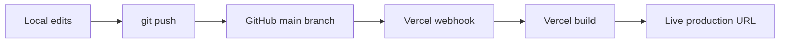

# personal-website

Personal portfolio site for Fatema Alasbahi — a multi-page showcase of education, skills, projects, and experience.

**Live site:** [https://personal-website-rho-nine-94.vercel.app](https://personal-website-rho-nine-94.vercel.app)

**Repository:** [github.com/fatemaalasbahi/personal-website](https://github.com/fatemaalasbahi/personal-website)

## Tech stack

| Technology | Role | Why it was chosen |
| --- | --- | --- |
| [Vite](https://vite.dev/) | Build tool & dev server | Fast local development and a production-ready static build with minimal configuration |
| [React](https://react.dev/) | UI framework | Component-based pages that are easy to extend as the portfolio grows |
| [React Router](https://reactrouter.com/) | Client-side routing | Clean URLs for Home, About, Skills, Experience, Projects, Resume, and Contact |
| [Vercel](https://vercel.com/) | Hosting & CI/CD | Automatic deploys from GitHub with SPA routing support via `vercel.json` |
| [GitHub](https://github.com/) | Source control & remote | Public repo, version history, and the trigger for Vercel production builds |
| [ESLint](https://eslint.org/) | Linting | Keeps the codebase consistent and catches common issues early |

## Deploy pipeline



1. Edit files locally in `personal-website/`
2. Commit and push to `main` on GitHub
3. Vercel receives the webhook, runs `npm run build`, and publishes the site
4. Production URL updates at [personal-website-rho-nine-94.vercel.app](https://personal-website-rho-nine-94.vercel.app)

## Run locally

**Requirements:** Node.js 18+ and npm

```bash
git clone https://github.com/fatemaalasbahi/personal-website.git
cd personal-website
npm install
npm run dev
```

Open the URL shown in the terminal (usually `http://localhost:5173`).

### Other commands

```bash
npm run build    # production build → dist/
npm run preview  # preview the production build locally
npm run lint     # run ESLint
```

## Project structure

```
src/
  components/   # shared layout (nav, footer)
  data/         # site content (siteData.js)
  pages/        # route pages (Home, About, Skills, …)
public/         # static assets (resume PDF, favicon)
vercel.json     # SPA rewrite rules for client-side routing
```

## License

Private portfolio project — all rights reserved.
